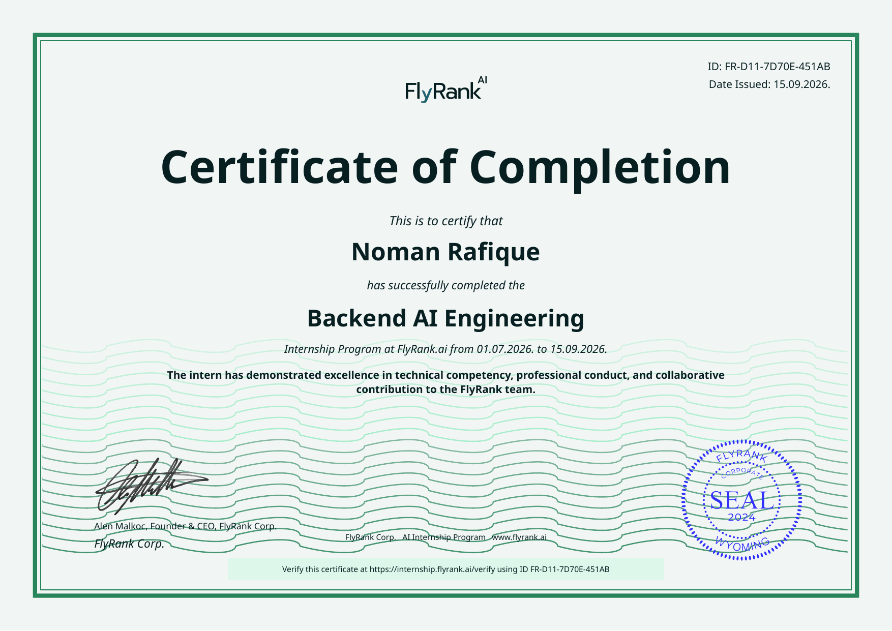
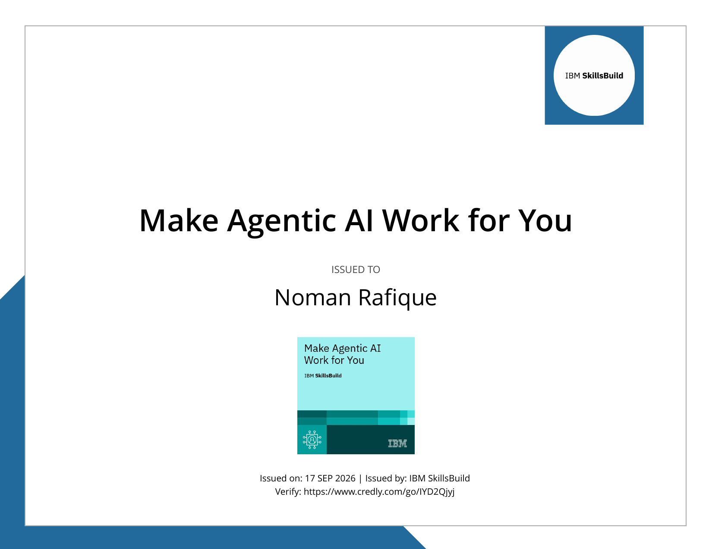
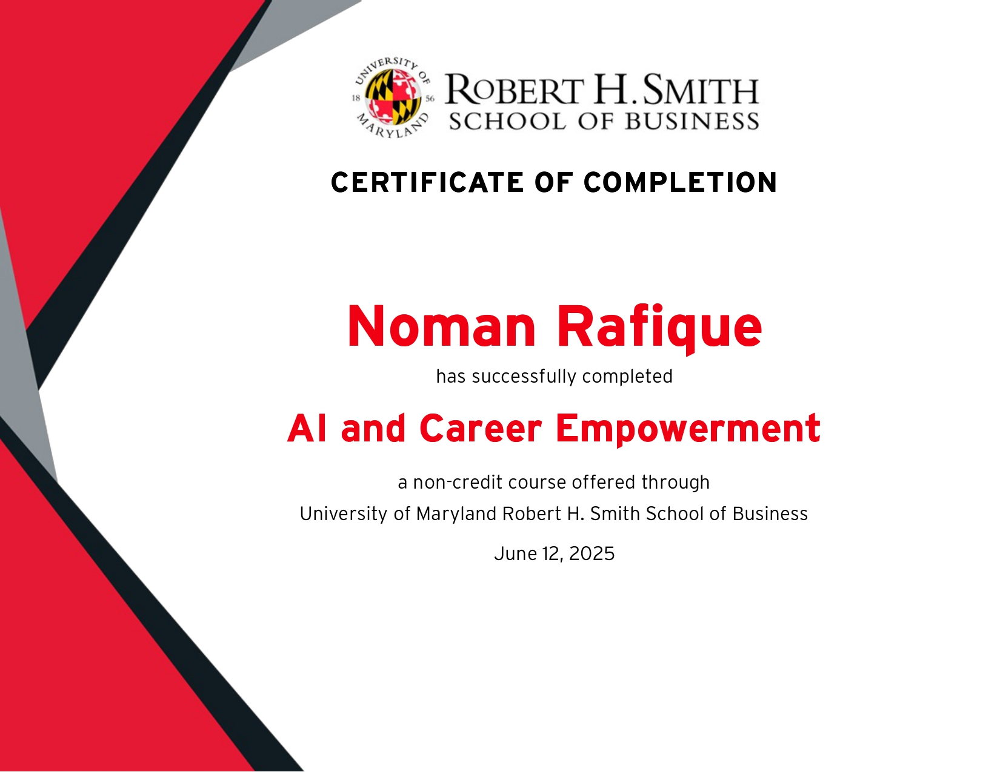
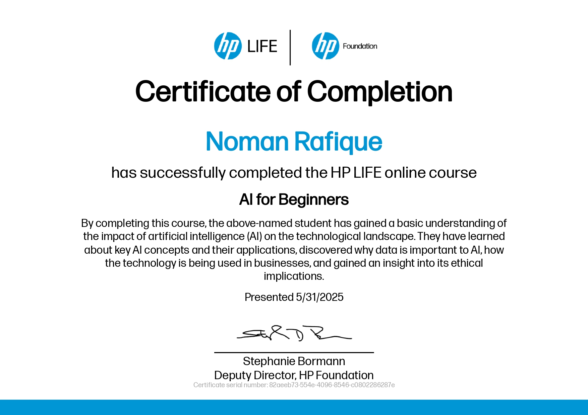
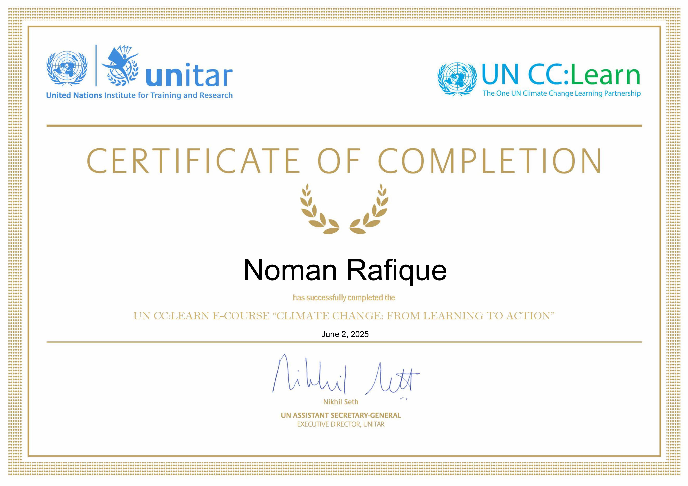

# 🏆 Certificates & Professional Credentials

A curated showcase of verified certifications, professional courses, and industry credentials in Artificial Intelligence, Prompt Engineering, and Autonomous Systems Development.

## 📊 Overview

- **Total Certificates:** 28
- [💼 Internship Certificate](#internship): **1** certificate
- [🎓 Anthropic Academy Certificates](#anthropic_academy): **20** certificates
- [🤖 OpenAI & Custom GPTs](#openai): **1** certificate
- [🔷 IBM Certifications](#ibm_cert): **1** certificate
- [⚖️ AI Ethics & Career Empowerment](#ai_ethics_and_career): **2** certificates
- [🏅 Extra-Curricular Certificates](#extra_crricular_cert): **1** certificate
- [📜 Miscellaneous & Other Certifications](#misc): **2** certificates

---

## 💼 Internship Certificate

> Verified industry completion certificate for professional backend AI engineering internship experience.

### FlyRank – Backend AI Engineering Internship (Certificate of Completion)

📄 **PDF Document:** [flyrank-certificate-of-completion-backend-ai-engineering-f569eee5-d3c9-49b9-818e-541a5a9123f5.pdf](Internship/flyrank-certificate-of-completion-backend-ai-engineering-f569eee5-d3c9-49b9-818e-541a5a9123f5.pdf)

  

---

## 🎓 Anthropic Academy Certificates

> Comprehensive 20-course certification series from Anthropic covering Claude architecture, prompt engineering, agentic skills, subagents, and Model Context Protocol (MCP).

<table>
  <tr>
    <td width="25%" align="center" valign="top">
      
       
      <strong>AI Capabilities and Limitations</strong>
       
      <a href="Anthropic_Academy/AI%20Capabilities%20and%20Limitations.pdf">📄 View PDF</a>
    </td>
    <td width="25%" align="center" valign="top">
      
       
      <strong>AI Fluency (Framework & Fundations)</strong>
       
      <a href="Anthropic_Academy/AI%20Fluency%20%28Framework%20%26%20Fundations%29.pdf">📄 View PDF</a>
    </td>
    <td width="25%" align="center" valign="top">
      
       
      <strong>AI Fluency for Builders</strong>
       
      <a href="Anthropic_Academy/AI%20Fluency%20for%20Builders.pdf">📄 View PDF</a>
    </td>
    <td width="25%" align="center" valign="top">
      
       
      <strong>AI Fluency for Educators</strong>
       
      <a href="Anthropic_Academy/AI%20Fluency%20for%20Educators.pdf">📄 View PDF</a>
    </td>
  </tr>
  <tr>
    <td width="25%" align="center" valign="top">
      
       
      <strong>AI Fluency for Non-profit</strong>
       
      <a href="Anthropic_Academy/AI%20Fluency%20for%20Non-profit.pdf">📄 View PDF</a>
    </td>
    <td width="25%" align="center" valign="top">
      
       
      <strong>AI Fluency for small businesses</strong>
       
      <a href="Anthropic_Academy/AI%20Fluency%20for%20small%20businesses.pdf">📄 View PDF</a>
    </td>
    <td width="25%" align="center" valign="top">
      
       
      <strong>AI Fluency for Students</strong>
       
      <a href="Anthropic_Academy/AI%20Fluency%20for%20Students.pdf">📄 View PDF</a>
    </td>
    <td width="25%" align="center" valign="top">
      
       
      <strong>AI Teaching Fluency</strong>
       
      <a href="Anthropic_Academy/AI%20Teaching%20Fluency.pdf">📄 View PDF</a>
    </td>
  </tr>
  <tr>
    <td width="25%" align="center" valign="top">
      
       
      <strong>Build with Claude API</strong>
       
      <a href="Anthropic_Academy/Build%20with%20Claude%20API.pdf">📄 View PDF</a>
    </td>
    <td width="25%" align="center" valign="top">
      
       
      <strong>Claude 101</strong>
       
      <a href="Anthropic_Academy/Claude%20101.pdf">📄 View PDF</a>
    </td>
    <td width="25%" align="center" valign="top">
      
       
      <strong>Claude Code 101</strong>
       
      <a href="Anthropic_Academy/Claude%20Code%20101.pdf">📄 View PDF</a>
    </td>
    <td width="25%" align="center" valign="top">
      
       
      <strong>Claude Code in Action</strong>
       
      <a href="Anthropic_Academy/Claude%20Code%20in%20Action.pdf">📄 View PDF</a>
    </td>
  </tr>
  <tr>
    <td width="25%" align="center" valign="top">
      
       
      <strong>Claude on Google Cloud</strong>
       
      <a href="Anthropic_Academy/Claude%20on%20Google%20Cloud.pdf">📄 View PDF</a>
    </td>
    <td width="25%" align="center" valign="top">
      
       
      <strong>Claude Platform 101</strong>
       
      <a href="Anthropic_Academy/Claude%20Platform%20101.pdf">📄 View PDF</a>
    </td>
    <td width="25%" align="center" valign="top">
      
       
      <strong>Claude with Amazon Bedrock</strong>
       
      <a href="Anthropic_Academy/Claude%20with%20Amazon%20Bedrock.pdf">📄 View PDF</a>
    </td>
    <td width="25%" align="center" valign="top">
      
       
      <strong>Intro to agent skills</strong>
       
      <a href="Anthropic_Academy/Intro%20to%20agent%20skills.pdf">📄 View PDF</a>
    </td>
  </tr>
  <tr>
    <td width="25%" align="center" valign="top">
      
       
      <strong>Introduction to Claude Cowork</strong>
       
      <a href="Anthropic_Academy/Introduction%20to%20Claude%20Cowork.pdf">📄 View PDF</a>
    </td>
    <td width="25%" align="center" valign="top">
      
       
      <strong>Introduction to MCP</strong>
       
      <a href="Anthropic_Academy/Introduction%20to%20MCP.pdf">📄 View PDF</a>
    </td>
    <td width="25%" align="center" valign="top">
      
       
      <strong>Introduction to Subagents</strong>
       
      <a href="Anthropic_Academy/Introduction%20to%20Subagents.pdf">📄 View PDF</a>
    </td>
    <td width="25%" align="center" valign="top">
      
       
      <strong>MCP (Advance Topics)</strong>
       
      <a href="Anthropic_Academy/MCP%20%28Advance%20Topics%29.pdf">📄 View PDF</a>
    </td>
  </tr>
</table>

---

## 🤖 OpenAI & Custom GPTs

> Specialized certifications in OpenAI technologies, GPT customization, and prompt engineering workflows.

### OpenAI – Certificate in OpenAI GPTs: Creating Your Own Custom AI

📄 **PDF Document:** [Certificate in OpenAI GPTs Creating Your Own Custom AI_page-0001.pdf](OpenAI/Certificate%20in%20OpenAI%20GPTs%20Creating%20Your%20Own%20Custom%20AI_page-0001.pdf)

  

---

## 🔷 IBM Certifications

> Industry credentials and digital badges awarded by IBM SkillsBuild for Agentic AI architecture and workflows.

### IBM SkillsBuild – Make Agentic AI Work for You

📄 **PDF Document:** [MakeAgenticAIWorkforYou_Badge20260925-20-xj3ay.pdf](IBM_Cert/MakeAgenticAIWorkforYou_Badge20260925-20-xj3ay.pdf)

  

---

## ⚖️ AI Ethics & Career Empowerment

> Foundational certifications in artificial intelligence ethics, governance, and professional career development.

### AI and Career Empowerment – Noman Rafique

📄 **PDF Document:** [ai-and-career-empowerment-noman-rafique_page-0001.pdf](AI_Ethics_and_Career/ai-and-career-empowerment-noman-rafique_page-0001.pdf)

  

---

### Certificate of Ethics of Artificial Intelligence

📄 **PDF Document:** [Certificate of Ethics of Artificial Intelligence.pdf](AI_Ethics_and_Career/Certificate%20of%20Ethics%20of%20Artificial%20Intelligence.pdf)

  

---

## 🏅 Extra-Curricular Certificates

> Honors, competitive achievements, and inter-college quiz competition awards.

### NUML – 1st Position Inter-Colleges Quiz Competition (Certificate of Appreciation)

📄 **PDF Document:** [Numl certificate.pdf](Extra_Crricular_Cert/Numl%20certificate.pdf)

  

---

## 📜 Miscellaneous & Other Certifications

> Additional awards and professional development courses from HP Foundation and UNITAR.

### HP LIFE – AI for Beginners

📄 **PDF Document:** [82aeeb73-554e-4096-8546-c0802286287e_page-0001.pdf](Misc/82aeeb73-554e-4096-8546-c0802286287e_page-0001.pdf)

  

---

### UNITAR UN CC:Learn – Climate Change: From Learning to Action

📄 **PDF Document:** [Certificate_of_Completion-images-0.pdf](Misc/Certificate_of_Completion-images-0.pdf)

  

---
